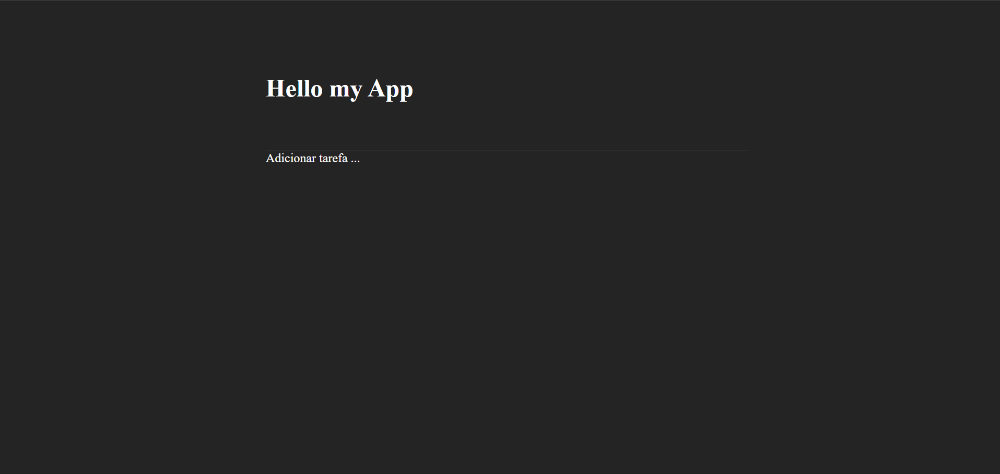
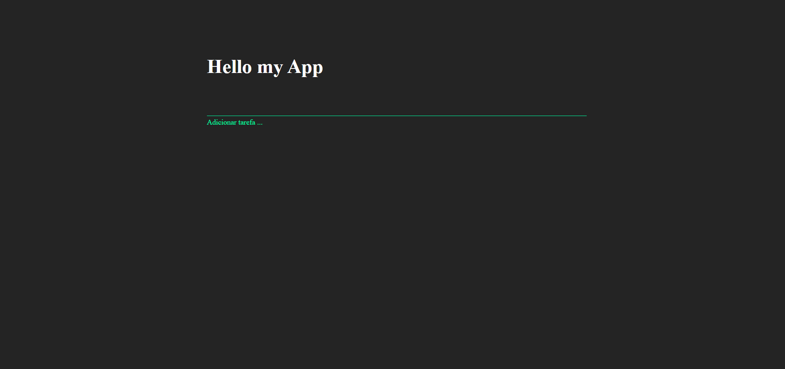

# 🚀 React App – Projeto Impressionador

Aplicação React moderna estruturada com boas práticas, uso de componentes reutilizáveis, estilo com Sass e pronta para futura integração com **Json-Server** e **Zod**.

---

## 📦 Tecnologias Utilizadas

#### React App JSX

- [x] **React 18**
- [x] **Sass**
- [x] **Components**
- [ ] **Json-Server** (em desenvolvimento)
- [ ] **Zod** (em desenvolvimento)

---

## 🖥️ Preview das Telas

### 🏠 Home


### ✏️ Home – Input Focus


---

## ▶️ Como Rodar o Projeto

```bash
# Instalar dependências
npm install

# Rodar o projeto
npm run dev

src/
  ├── components/
  ├── pages/
  ├── assets/
  └── App.jsx
